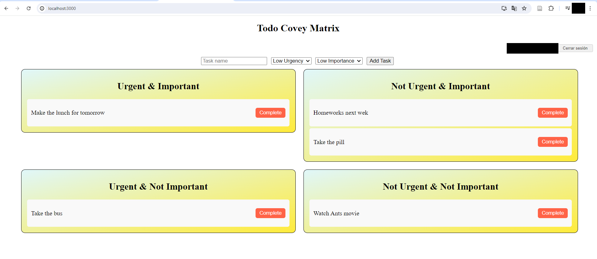

# TODO Covey Matrix App

This project is a TODO list application built with React and Firebase. It allows users to organize their tasks based on urgency and importance using the Covey Matrix framework.

## Features

- User authentication with Google using Firebase Authentication.
- CRUD operations for tasks: Create, Read, Update, and Delete tasks.
- Task categorization into Urgent & Important, Not Urgent & Important, Urgent & Not Important, and Not Urgent & Not Important.
- Local storage of tasks for non-authenticated users.
- Real-time synchronization of tasks with Firestore for authenticated users.

## Technologies Used

- React: Frontend library for building user interfaces.
- Firebase: Backend-as-a-Service (BaaS) platform for authentication and database (Firestore).
- HTML/CSS: Basic styling and structure of the application.
- JavaScript: Programming language used for frontend logic.